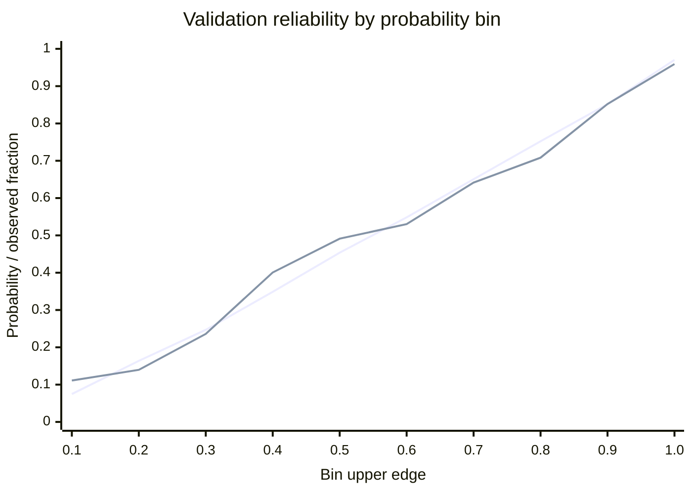

# MED-SALES-05 Lead Scoring Model Card

## Model, intended use and population

**Version:** `med-sales-lead-1.0.0`. Selected family: **Logistic Regression**, with a saved train-fitted median imputer and StandardScaler. Features: `lead_features_v1`; target: `repeat_purchase_30d_v1`; split: `lead_temporal_split_v1`; canonical contract: `sales_contract_v1`.

**Synthetic-development use only.** This model demonstrates learning and local inference from simulated commerce histories. It is not evidence of predictive performance on real pharmacy customers and is not enabled for operational customer targeting.

The eligible population consists of known customers with complete source coverage and at least one known completed purchase in **[T-60 days,T]**. Predict whether a **new order is both created and completed in (T,T+30 days]**. Complete mature follow-up is required for both label classes. New customers, lapsed customers without qualifying history, and incomplete telemetry receive explicit unavailable/out-of-scope statuses rather than fabricated probabilities. The observation unit is customer/source/T, sampled on Mondays for this benchmark.

The frozen source is `synthetic_sales_260903_079a482eb7f58fb0`. No SALES-03 generation, SALES-04 feature/label rebuilding, source tuning, resampling or extra features occurred. See [dataset report](LEAD_SCORING_DATASET_REPORT.md) and [foundation](SALES_AI_FOUNDATION.md), sections 6 and 11. At interruption recovery, no SALES-05 implementation or trained artifact existed; the checkpointed SALES-04 hashes were verified before continuing.

## Data, chronology and bounded configurations

| Partition | Observed Mondays | Rows | Customers | Positives | Negatives |
|---|---|---:|---:|---:|---:|
| TRAIN | 2025-11-03 through 2026-02-23 | 9,428 | 917 | 4,373 | 5,055 |
| VALIDATION | 2026-04-06 through 2026-04-27 | 2,272 | 664 | 1,068 | 1,204 |
| TEST | 2026-06-01 through 2026-07-27 | 5,245 | 811 | 2,564 | 2,681 |

The approved observation intervals are TRAIN [2025-11-01,2026-03-01), validation [2026-04-01,2026-05-01), test [2026-06-01,2026-08-02), all UTC. March and May purge gaps remain intact; warm-up and tail have no modeling rows. Label cutoffs remain April 1, June 1, and the actual source freeze **2026-08-31T23:59:59.999999Z**, respectively.

The trainer verifies the pinned SALES-04 hash manifest, all 15 declared payload hashes, exact ordered feature headers, target/split manifests and split/index/label alignment. Integrity/schema checks read source bytes, including test bytes; **test predictions and metrics are gated until selection is frozen**. Only the positive 28-feature allowlist enters estimators. Customer/example/product IDs and future references stay outside the feature matrix.

Exactly two competitive families were fitted once each on the 9,428 TRAIN rows, seed **260903**, one numerical thread, no configuration adjustment:

| Family | Predefined configuration | Preprocessing |
|---|---|---|
| Logistic Regression | C=1, lbfgs, max_iter=1000, tol=1e-6, no class weights | TRAIN median imputation, then TRAIN StandardScaler |
| HistGradientBoostingClassifier | log_loss, learning_rate=0.05, max_iter=150, max_leaf_nodes=15, min_samples_leaf=30, l2_regularization=1, early_stopping=false, no categorical inputs | Native NaN handling; no imputer/scaler |

Only `days_since_last_cart_add` can be null; its existing `no_cart_add_60d` flag retains the meaning of no observed add under complete coverage. Imputation does not rescue incomplete telemetry. Preprocessor learned statistics, training row-ID digest and estimator input names are persisted. No fitting uses validation/test, including internal random early-stopping splits. The optional `sales-training` dependency group reuses permitted versions without DDI/RDKit imports; no packages were downloaded.

## Selection, technical threshold and metrics

The primary metric is **`sklearn.metrics.average_precision_score`**, not trapezoidal PR-curve area. Before fitting, the practical-tie tolerance was fixed at **0.005 absolute validation AP**, with Logistic Regression preferred within that tolerance. Brier/calibration and per-Monday stability are supporting diagnostics, not test-based selection rules.

| Candidate, validation | AP | ROC-AUC | Brier | F1 at shared technical threshold |
|---|---:|---:|---:|---:|
| Logistic Regression | 0.8133 | 0.8084 | 0.1763 | 0.7276 |
| HistGradientBoosting | 0.8114 | 0.8097 | 0.1755 | 0.7220 |

Logistic Regression has slightly higher AP (gap **0.001922**) and is selected under the predefined simpler-model tie rule. HGB has slightly lower validation Brier (0.175535 versus 0.176327), which does not override that rule. HGB train AP is 0.8658 versus validation 0.8114; no additional tuning followed.

**Technical threshold: `0.29511255802121295`.** It maximizes validation F1 for the selected model, breaking equal-F1 ties within 1e-12 toward the higher threshold. Predict technically positive when p >= threshold. Candidate F1 values above use this same selected-model threshold; no second threshold was optimized. This is `technical_validation_threshold`, **not** an operational capacity/cost policy. No High/Medium/Low bands exist.

Selection, preprocessing, threshold and `calibration_method=none` were saved in `selection_frozen.json` before test access. The selected model's TEST `predict_proba` ran **once**; all final diagnostics reuse that array. The other candidate was not evaluated on TEST. No refit, adjustment or source change followed.

Selected-model results:

| Split | Prevalence | AP | ROC-AUC | Brier | Log loss |
|---|---:|---:|---:|---:|---:|
| train | 0.4638 | 0.8191 | 0.8250 | 0.1694 | 0.5112 |
| validation | 0.4701 | 0.8133 | 0.8084 | 0.1763 | 0.5236 |
| test | 0.4888 | 0.8412 | 0.8318 | 0.1675 | 0.5048 |

| Split | Precision | Recall | F1 | Accuracy (secondary) | Confusion matrix [[TN,FP],[FN,TP]] |
|---|---:|---:|---:|---:|---|
| train | 0.6465 | 0.8495 | 0.7343 | 0.7148 | [[3024,2031],[658,3715]] |
| validation | 0.6359 | 0.8502 | 0.7276 | 0.7007 | [[684,520],[160,908]] |
| test | 0.6691 | 0.8580 | 0.7519 | 0.7232 | [[1593,1088],[364,2200]] |

The noncompetitive constant reference predicts TRAIN prevalence **0.4638311413** for every row. Validation AP/ROC-AUC/Brier are **0.4701 / 0.5000 / 0.2491**; test values are **0.4888 / 0.5000 / 0.2505**. The selected model learns beyond prevalence within this simulation; this does not establish business effectiveness.

### Top-decile ranking

Primary ranking follows the foundation: within each observation Monday, k=ceil(0.10*n), ordered by descending unrounded probability with `example_id` ascending for exact ties. IDs only resolve ordering. Aggregate hits, selected rows and actual positives give the reported precision, recall and lift.

| Split | Selected k (sum of Monday ceilings) | Hits | Precision@10% | Recall@10% | Lift@10% |
|---|---:|---:|---:|---:|---:|
| train | 952 | 907 | 0.9527 | 0.2074 | 2.0540 |
| validation | 229 | 221 | 0.9651 | 0.2069 | 2.0530 |
| test | 528 | 514 | 0.9735 | 0.2005 | 1.9914 |

For the separate **pooled** test diagnostic, k=525, hits=507, precision=0.9657, recall=0.1977 and lift=1.9755. The primary within-Monday result uses k=528 and hits=514. Neither is causal intervention uplift.

## Native probability calibration and temporal stability

**No post-hoc calibration was fitted.** Four validation Mondays provide limited independent temporal evidence. Validation Brier improves over the constant reference; reliability bins broadly track observed fractions, with remaining deviations and sparse tails. This does not justify real-world probability claims. For example, the 0.3-0.4 bin has mean output 0.3486 versus observed 0.4006; the lowest bin contains only 9 rows.

The first line below is mean native probability, the second is observed conversion fraction, grouped by ten fixed-width probability bins. The standalone chart definition is [calibration_curves.mmd](../artifacts/sales/lead/model/v1/calibration_curves.mmd); exact bin counts and values are retained in the metrics JSON.

Validation positives have median output **0.6381** (10th-90th percentiles 0.2535-0.9902); negatives have median **0.2677** (0.1567-0.6045). The distributions overlap: a negative reaches 0.9898 and a positive is as low as 0.0717. Histograms/quantiles and reliability bins for both candidates on validation, and the selected model on all splits, are saved.

| Split | Monday | Rows | Prevalence | AP | ROC-AUC | Brier |
|---|---|---:|---:|---:|---:|---:|
| validation | 2026-04-06 | 562 | 0.4733 | 0.8247 | 0.8129 | 0.1728 |
| validation | 2026-04-13 | 557 | 0.4901 | 0.8307 | 0.8171 | 0.1745 |
| validation | 2026-04-20 | 578 | 0.4516 | 0.7990 | 0.8049 | 0.1777 |
| validation | 2026-04-27 | 575 | 0.4661 | 0.8022 | 0.8000 | 0.1801 |
| test | 2026-06-01 | 604 | 0.4702 | 0.8507 | 0.8384 | 0.1595 |
| test | 2026-06-08 | 596 | 0.4815 | 0.8654 | 0.8490 | 0.1564 |
| test | 2026-06-15 | 590 | 0.5034 | 0.8418 | 0.8173 | 0.1732 |
| test | 2026-06-22 | 571 | 0.5026 | 0.8392 | 0.8290 | 0.1727 |
| test | 2026-06-29 | 576 | 0.4948 | 0.8472 | 0.8363 | 0.1652 |
| test | 2026-07-06 | 569 | 0.4886 | 0.8555 | 0.8480 | 0.1610 |
| test | 2026-07-13 | 577 | 0.4697 | 0.8271 | 0.8369 | 0.1661 |
| test | 2026-07-20 | 570 | 0.4842 | 0.8200 | 0.8197 | 0.1748 |
| test | 2026-07-27 | 592 | 0.5051 | 0.8335 | 0.8144 | 0.1787 |

Validation median Monday AP is **0.8135**, range **0.7990-0.8307**; test median is **0.8418**, range **0.8200-0.8654**. No single-class Mondays occur. Metrics use null for undefined cases rather than misleading scores. Weekly histories/outcomes overlap, so these rows are correlated; no independent-row confidence intervals are claimed.

Customer overlap across temporal partitions remains intentional (509 train/validation, 539 train/test, 533 validation/test). Snapshot-count histograms are persisted: validation has 57/74/65/468 customers with 1/2/3/4 snapshots; test has 49/52/73/44/59/66/74/58/336 customers with 1 through 9 snapshots. These counts are diagnostic metadata, not features.

Customers with exactly one snapshot within validation contribute 57 rows (8 positives), AP **0.2519**, versus **0.8162** over 2,215 multi-snapshot rows. Test has 49 single-snapshot rows (7 positives), AP **0.2809**, versus **0.8422** over 5,196 multi-snapshot rows. These small, differently prevalent groups suggest limited evidence for less-established histories; they are not a new customer-disjoint benchmark.

## Associations and synthetic-shortcut assessment

Largest absolute standardized Logistic Regression coefficients (conditional on all other included features):

| Feature | Standardized coefficient |
|---|---:|
| `cart_add_count_60d` | 1.1742 |
| `session_count_60d` | 0.8284 |
| `product_view_count_60d` | -0.5056 |
| `purchase_count_60d` | 0.4043 |
| `purchase_count_30d` | 0.3289 |
| `cart_add_count_30d` | 0.3053 |

Positive cart/session/purchase coefficients indicate associations inside this synthetic dataset. The negative product-view coefficient is conditional on correlated session/cart/purchase counts; it does not establish that viewing products reduces purchases. Nested windows and correlated features make individual coefficients unstable as causal explanations.

For HGB, validation permutation importance used exactly three repeats per feature, AP scoring and one thread. Largest mean AP decreases were cart_add_count_60d **0.0747**, purchase_count_60d **0.0548**, and session_count_60d **0.0165**. Permutations can create implausible feature combinations; no SHAP/dependency expansion was used.

Four predefined single-feature rankings (no additional fitted models) give validation AP:

| Raw ranking | AP |
|---|---:|
| Higher purchase_count_60d | 0.7528 |
| Lower purchase_recency_days | 0.6242 |
| Higher session_count_60d | 0.7646 |
| Higher cart_add_count_60d | 0.7909 |

Cart activity alone captures much of the selected model's AP 0.8133, making synthetic behavioral shortcuts a material limitation. None of these rankings or the selected model reaches the predefined 0.95 AP diagnostic flag, and positive/negative probabilities overlap. Nevertheless, approximately 97% precision in the selected test deciles is very strong simulated separation, not proof of real-customer prioritization quality. Source behavior was not tuned after observing any result.

## Saved bundle, local inference and runtime

Bundle: `artifacts/sales/lead/model/v1/default_260903/`. It includes the selected pipeline, metadata, preprocessing statistics, copied feature/target/split manifests, source hashes, fixed training config, validation candidate metrics/diagnostics, final metrics, threshold, dependency versions and fitting/test-order audit.

**Trusted bundle manifest SHA-256:**
`3b9a1132ab9101bb334859737674d0ddf65c82a3f2ab89298f1428611f2c9df2`

**Frozen SALES-04 manifest SHA-256:**
`c7dddb1da5cb7ddcb192d90767e5f5803709a46ce450b29fdbdef9cfbcfccad8`

The loader requires that bundle pin from trusted caller configuration, verifies all 17 payloads and contract/dependency compatibility, then deserializes the exact verified model bytes. A checksum stored alongside untrusted model bytes is not authentication. Only trusted local joblib artifacts may be loaded. Missing/partial/corrupt/incompatible bundles fail explicitly. Nonempty experiment directories cannot be silently overwritten or reused for a test rerun.

Local commands: `python -m medsense_ai.lead_scoring.model.cli train` with explicit source/output paths and `--expected-source-hash`; `... score` with `--bundle-dir`, `--expected-bundle-hash`, and a typed JSON `--input`. No HTTP routes or partner adapters were added.

Inference requires `feature_version=lead_features_v1` and the frozen typed feature object. Missing/extra fields, invalid types/null combinations or wrong feature order/version fail explicitly. `score_canonical` reuses SALES-04 `LeadIndex`/`build_features` and returns scored, out_of_scope, insufficient_data, model_unavailable or invalid_input. No inference path fits or recalculates features independently. Rejected feature payloads are omitted from logs.

`model_probability` remains the native output; **lead_score = 100 * model_probability**, with no numeric rounding in the contract. Display rounding does not create a new confidence/value measure. The output includes versions, synthetic notice, technical threshold and technical binary prediction; canonical scoring additionally records customer/source/T.

Two actual validation smoke examples, both at 2026-04-20:

- `customer_001693`: p **0.7781515657**, score **77.8152**, technical positive.
- `customer_000678`: p **0.9349650189**, score **93.4965**, technical positive.

Repeated feature-vector scoring is identical; canonical reconstruction produces the same probabilities. These are simulated customer identifiers, not real customers. Evidence is in `artifacts/sales/lead/model/v1/runtime_smoke.json`.

Measured candidate training: LR **0.129 s**, HGB **0.520 s**; selection plus validation diagnostics **3.921 s**; final test diagnostics **0.137 s**; experiment **8.531 s**, excluding initial source verification and final serialization. Bundle verification/load **0.251 s**. Warm feature scoring: median **11.966 ms**, p95 **12.486 ms**, 50 calls. Canonical feature-plus-inference: median **13.418 ms**, p95 **14.344 ms**, 10 calls with an already loaded/indexed source. Initial canonical load/validation takes **17.760 s** and indexing **1.317 s** separately. These are local measurements, not service latency guarantees.

## Verification, limitations and future validation

Verification: **30 targeted tests passed** (6.50 s), **394 combined sales/lead tests passed** (34.81 s), and the **full regression ran once: 637 passed** (77.33 s). Tests cover exact source columns/hashes/splits, deterministic family fits, train-only preprocessing, AP/tie selection, technical thresholds, metric edge cases, temporal reporting, test-release order, bundle integrity, strict inference and existing canonical feature reuse. Imports, startup, in-process health (HTTP 200) and dependency checks passed.

The final protection audit checks 29 frozen source/document hashes, 192 existing data/artifact size-and-mtime records, all eight SALES-03 canonical hashes, all 15 SALES-04 payload hashes and all 17 saved-bundle payload hashes. DDI, SALES-03 and SALES-04 remain unchanged. Git changes are confined to the new model package, two model test/fixture files, this model card and the minimal optional sales-training dependency group. The pre-existing untracked SRS PDF was left untouched. Full evidence and the file list are in `artifacts/sales/lead/model/v1/verification_report.json`. No external network calls or API/frontend/partner work occurred.

Limitations include one synthetic source/seed, only four validation Mondays, correlated weekly observations, a returning-customer-only cohort, complete/on-time default telemetry, strong simulated behavioral relationships and weaker evidence for single-snapshot customers. No confidence intervals or causal marketing claims are supported. Current resolved versions are Python 3.13.9, scikit-learn 1.8.0, NumPy 2.5.2, SciPy 1.18.1, joblib 1.6.0, Pydantic 2.13.5 and threadpoolctl 3.6.0; incompatible bundles are rejected instead of assumed portable across arbitrary versions.

Prohibited interpretations: “47% means a real customer has a 47% chance to buy”; “Score 80 guarantees 80% conversion”; automatic targeting based on score; proof on real pharmacy customers; accuracy as proof of business effectiveness; score as customer lifetime value/confidence/clinical meaning; or promotion effects inferred from predicted conversion.

Real-data adoption requires authorized partner data, stable canonical mappings and completion/identity/coverage policies, representative mature history and outcomes, a fresh chronological evaluation, missingness/drift and cohort analysis, calibration assessment, and an agreed capacity/cost policy. Demonstrating campaign effectiveness requires separate causal/intervention evidence. Neither a high score nor synthetic calibration authorizes pharmacy or clinical decisions.

**Next exact task: MED-SALES-06 — Sales Analytics & Explainable Sales Optimization Engine. Not started.**
